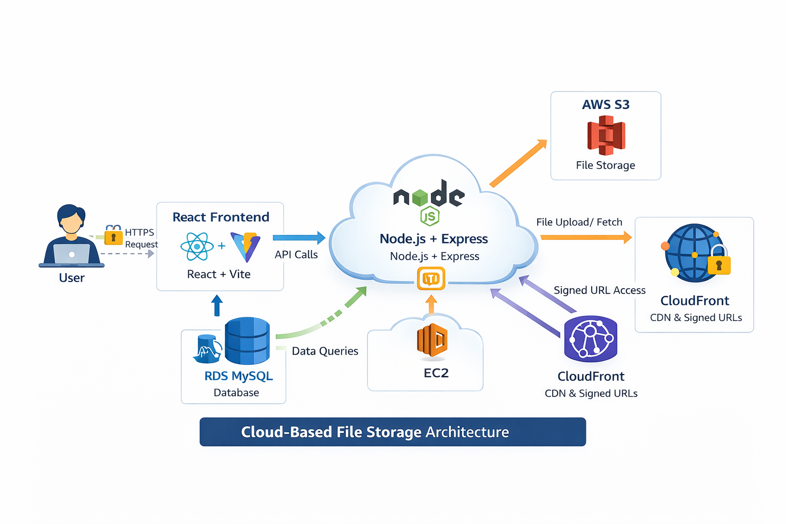
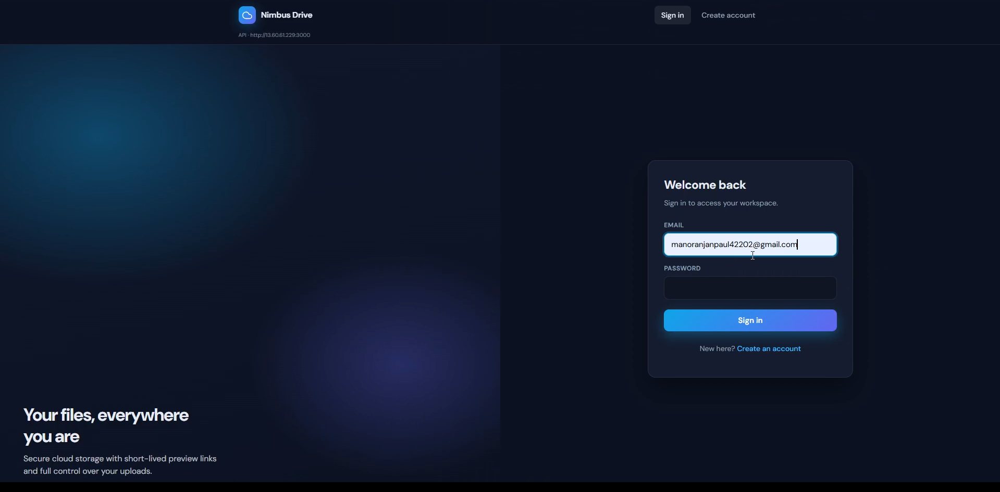
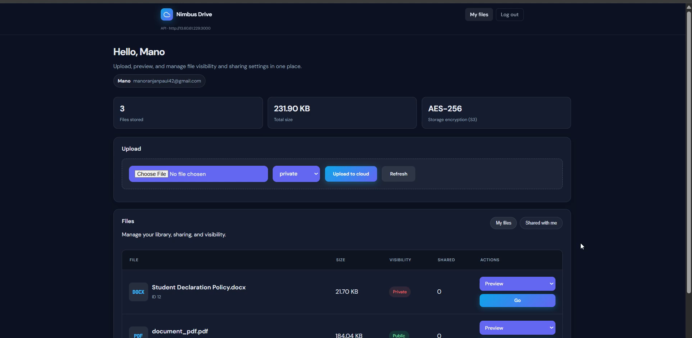
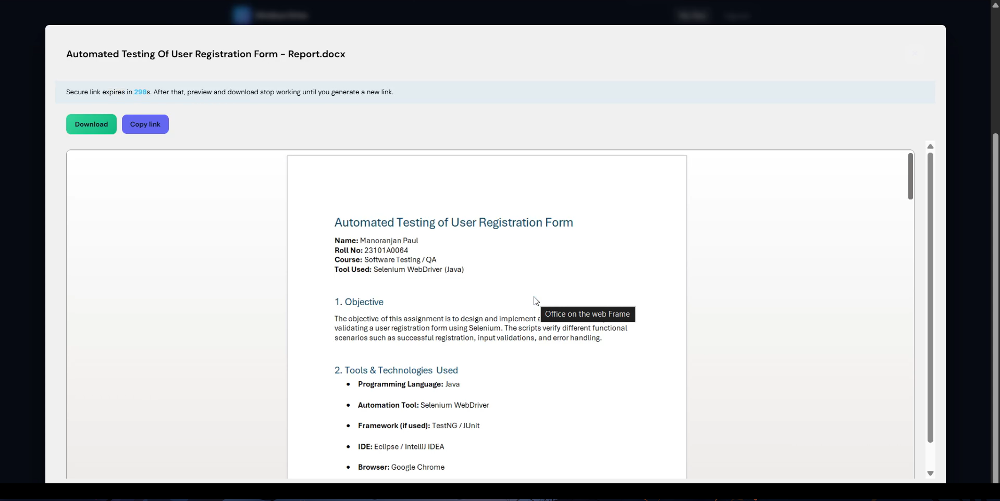

# Cloud-Based File Storage

Full-stack file storage and sharing app built with React + Vite (frontend) and Express + MySQL + AWS S3 (backend).

## Features

- User authentication (signup, login, JWT-based protected routes)
- Upload files to Amazon S3
- File visibility controls: `private`, `shared`, `public`
- Share files with other users by email
- Per-share permissions: `view` or `download`
- Rename, revoke sharing, and delete files
- Signed URL based preview/download (CloudFront when configured, S3 fallback)

## Tech Stack

- **Frontend:** React, TypeScript, Vite, Axios, React Router
- **Backend:** Node.js, Express, Multer, JWT, bcryptjs
- **Database:** Amazon RDS MySQL
- **Cloud:** AWS S3, optional AWS CloudFront signed URLs

## 🏗️ Architecture Diagram

   

## 📸 Screenshots

    
    
   

## Project Structure

```text
cloud-based-filestorage/
├─ backend/      # Express API, auth, file management, AWS integration
├─ frontend/     # React + Vite client
└─ db/           # SQL schema
```

## Prerequisites

- Node.js 18+ (recommended)
- npm
- MySQL instance (local or remote/RDS)
- AWS S3 bucket credentials
- (Optional) CloudFront distribution and key pair for signed links

## AWS Setup (Step-by-step)

Follow this once before running the app.

### 1) Create an Amazon RDS MySQL instance

1. Open AWS Console -> **RDS** -> **Create database**
2. Choose:
   - **Engine type:** MySQL
   - **Templates:** Free tier (for practice) or Dev/Test
3. In **Credentials settings**, set:
   - Master username (example: `admin`) -> this is your `DB_USER`
   - Master password -> this is your `DB_PASSWORD`
4. In **Connectivity**:
   - Keep/create a VPC and DB subnet group
   - Set **Public access** to **Yes** if connecting from your local machine
   - Choose/create a security group
5. Click **Create database** and wait until status is **Available**
6. Open the DB instance and copy:
   - **Endpoint** -> `DB_HOST` (use endpoint hostname only, without `:3306`)
   - **Port** -> `DB_PORT` (default `3306`)

### 2) Configure RDS security group (important)

1. In your RDS instance, open the attached **VPC security group**
2. Go to **Inbound rules** -> **Edit inbound rules**
3. Add rule:
   - Type: `MySQL/Aurora`
   - Port: `3306`
   - Source: your current public IP with `/32` (recommended for safety)
4. Save rules

> For production, do not allow broad access like `0.0.0.0/0`. Use app server/VPC-only access.

### 3) Create the app database on RDS

Connect to your RDS instance using MySQL Workbench or CLI, then run:

```sql
CREATE DATABASE your_db_name;
```

Use this name as `DB_NAME` in your backend `.env`.

### 4) Create an S3 bucket

1. Open AWS Console -> **S3** -> **Create bucket**
2. Enter a globally unique bucket name (example: `my-file-storage-app-123`)
3. Choose your preferred AWS Region (save this value, it will be `AWS_REGION`)
4. Keep default settings unless you have custom requirements
5. Click **Create bucket**

### 5) Create IAM user and access keys

1. Open AWS Console -> **IAM** -> **Users** -> **Create user**
2. Name it (example: `file-storage-app-user`)
3. In permissions, attach a policy with S3 access for your bucket (example policy below)
4. After user creation, go to **Security credentials**
5. Click **Create access key** (use-case: local development)
6. Save:
   - Access key ID -> `AWS_ACCESS_KEY_ID`
   - Secret access key -> `AWS_SECRET_ACCESS_KEY`

### 6) Attach minimum S3 policy

Replace `YOUR_BUCKET_NAME` below and attach this policy to the IAM user/role:

```json
{
  "Version": "2012-10-17",
  "Statement": [
    {
      "Effect": "Allow",
      "Action": [
        "s3:PutObject",
        "s3:GetObject",
        "s3:DeleteObject"
      ],
      "Resource": "arn:aws:s3:::YOUR_BUCKET_NAME/*"
    },
    {
      "Effect": "Allow",
      "Action": [
        "s3:ListBucket"
      ],
      "Resource": "arn:aws:s3:::YOUR_BUCKET_NAME"
    }
  ]
}
```

### 7) (Optional) Configure CloudFront signed URLs

Only needed if you want CloudFront-based signed links instead of direct S3 signed URLs.

1. Create a CloudFront distribution with your S3 bucket as origin
2. Note your distribution domain (example: `d123abcd.cloudfront.net`)
3. Create a CloudFront key pair / signer configuration
4. Save:
   - `CLOUDFRONT_URL` -> `https://<distribution-domain>`
   - `CLOUDFRONT_KEY_PAIR_ID`
   - `CLOUDFRONT_PRIVATE_KEY`

> If CloudFront values are not set, the backend automatically falls back to S3 signed URLs.

## Setup

### 1) Clone repository

```bash
git clone https://github.com/ManoranjanPaul42202/Cloud-File-Storage-App.git
cd Cloud-File-Storage-App
```

### 2) Install dependencies

```bash
cd backend
npm install

cd ../frontend
npm install
```

### 3) Configure backend environment

Create `backend/.env` (you can copy values from `backend/.env.save` as a template).  
Use values from the **AWS Setup (Step-by-step)** section:

```env
PORT=3000

DB_HOST=your_db_host
DB_USER=your_db_user
DB_PASSWORD=your_db_password
DB_NAME=your_db_name
DB_PORT=3306

AWS_ACCESS_KEY_ID=your_key
AWS_SECRET_ACCESS_KEY=your_secret
AWS_BUCKET_NAME=your_bucket_name
AWS_REGION=your_region

# Optional CloudFront signing config
CLOUDFRONT_URL=your_cloudfront_url
CLOUDFRONT_KEY_PAIR_ID=your_cloudfront_key_pair_id
CLOUDFRONT_PRIVATE_KEY=your_cloudfront_private_key

JWT_SECRET=your_jwt_secret
```

### 4) Configure frontend environment

Create `frontend/.env`:

```env
VITE_API_BASE_URL=http://localhost:3000
```

### 5) Create database schema

Run SQL from:

- `db/schema.sql`

This creates the required tables:
- `users`
- `files`
- `file_shares`

## Running the App

### Start backend

From `backend/`:

```bash
node server.js
```

Backend runs on `http://localhost:3000` by default.

### Start frontend

From `frontend/`:

```bash
npm run dev
```

Vite dev server usually runs on `http://localhost:5173`.

## API Overview

Base URL: `http://localhost:3000`

### Auth routes

- `POST /auth/signup`
- `POST /auth/login`
- `GET /auth/me` (requires Bearer token)
- `POST /auth/logout` (requires Bearer token)

### File routes (all require Bearer token)

- `GET /files` - list own files
- `GET /files/shared` - list files shared with current user
- `POST /files/upload` - upload file (`multipart/form-data`, field name: `file`)
- `GET /files/download?fileId=<id>` - get signed URL/public URL
- `GET /files/:id` - file details
- `PATCH /files/:id` - rename (`file_name`)
- `PATCH /files/:id/visibility` - update visibility
- `POST /files/:id/share` - share file
- `DELETE /files/:id/share` - revoke share
- `DELETE /files/:id` - delete file

## Notes

- Keep `.env` files out of version control.
- CloudFront settings are optional. If not configured, the app falls back to S3 signed URLs for protected access.
- The backend currently has no custom npm start script; use `node server.js` to run it.

## Future Improvements

- Add backend scripts (`dev`, `start`) with nodemon
- Add automated tests (API + UI)
- Add Docker setup for one-command local bootstrap
- Add CI/CD pipeline and linting workflow

## License

ISC (as currently set in `backend/package.json`).
